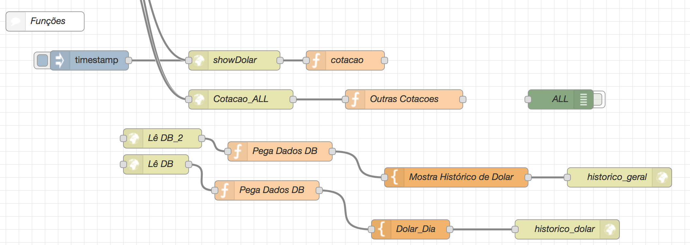

# Converte
APP Para Conversão de Moeda
Criado a partir da necessidade de fazer cotações rápidas, eu utilizava uma planilha, atualizando a cotação do dolar turismo manualmente. Desenvolvido em conjunto com outro colega de trabalho, que ajudou na inteligência da aplicação. Eu mantenho o código atualizado, e ajudo na concepção de novas ideias para implementações futuras.

## Esqueleto da Aplicação

## Funções
### Lê DB
  - Lê o Banco de dados e retorna o gráfico de dois dias da cotação do dólar
  - Lê o Banco de dados e retorna o gráfico histórico da cotação do dólar
### Cotação
  - Utiliza a seguinte API para cotação do Dolar Turismo: 
    URL: https://github.com/raniellyferreira/economy-api

## Registro de Informações
### Pega IP (Deprecated)
  - Lê o cabeçalho da requisição HTTP e pega o endereço IP
### GravaCotacaoDB
  - Gravação periódica das cotações para geração de gráfico histórico

## Change Log
### V0.1
    - Cartão de Crédito
    - Dólar - Banco
    - IOF 
    - Dinheiro
    - Baseado na planilha que está no Google Drive
    - Pegar IP
    
### V0.2
    - Interface Responsiva
    - Campos ajustados
    - Imagens nos labels
    - Clausula de isenção
    - Display de valores de referência
    - Copyright
    - Ajuste de segurança a pedido do Google

### V1.0
    - Dolar Turismo
    - Usar API
    - Ajustes no registro do IP
    - Favicon
    - Nova URL http://muambacalc.mybluemix.net/
    
### V1.5
    - Cotação mostrada na tela inicial
    - Variação da cotação mostrada através de emojis
    - Beta de registro histórico de cotação
    
### V1.7(Live)
    - Emoji indicativo na contação do Dolar na página principal
    - Emoji indicativo na contação do Dolar no painel de cotações
    - Cotação de outras moedas no painel de cotações
    - Registro da cotação do dólar 9x durante o dia e armazenado em DB
    - Histórico de 2 dias da cotação do Dolar
    - Painel com gráfico acessado no ícone de gráfico ou na url /dolar
    - Migração de serviços do Bluemix para outro provedor ainda em definição
    - Rollback dos gráficos devido a mudança de servidor, aguardando migração do Database.
    
### V2.0 (WORKING PROGRESS)
    - Mudança de framework
    - Crianção de Manifest para WebApp (PWA)
    - Mudança de tema de cores
